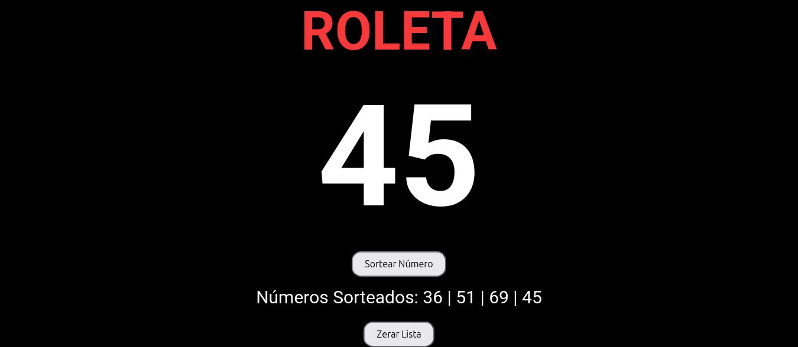

# 🎰 Roleta

## Um projeto desenvolvido para simular uma roleta digital, permitindo sorteios e escolhas de forma prática e interativa.

📌 Funcionalidades

Gira a roleta e seleciona um número de 0 a 100 de forma aleatória.

Interface simples e intuitiva.

🛠️ Tecnologias Utilizadas

HTML5

CSS3

JavaScript (DOM e lógica de sorteio)

## Deploy
https://roleta-4lin2zzhr-everton-rochas-projects.vercel.app/

## Screenshot:

